# 实验4：对象管理

## 实验目的：
了解Oracle表和视图的概念，学习使用SQL语句Create Table创建表，学习Select语句插入，修改，删除以及查询数据，学习使用SQL语句创建视图，学习部分存储过程和触发器的使用。


###  查询数据：
 1.查询某个员工的信息
  ```sql
select * from employees where employee_id=111;
```
  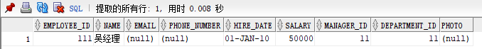
    
  2.递归查询某个员工及其所有下属，子下属员工。
  
   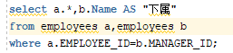
   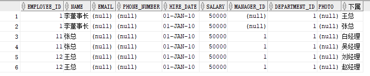 
   
  3.查询订单表，并且包括订单的订单应收货款: Trade_Receivable= sum(订单详单表.ProductNum*订单详单表.ProductPrice)- Discount。
  
  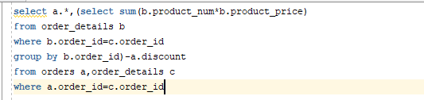
  
  
  4.查询订单详表，要求显示订单的客户名称和客户电话，产品类型用汉字描述。
  
  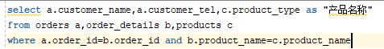
  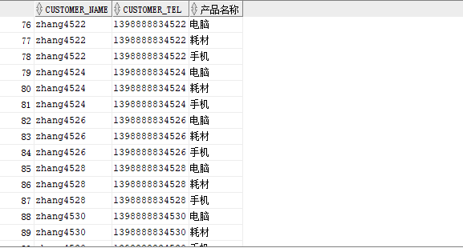
  
  5.查询出所有空订单。
  
  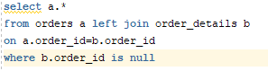
  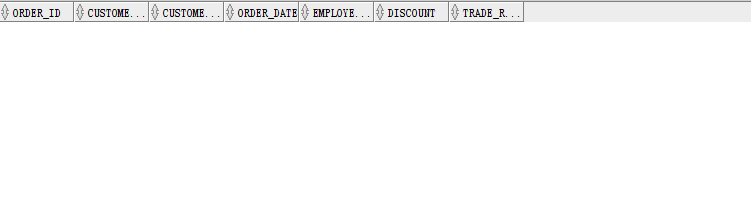
  6.查询部门表，同时显示部门的负责人姓名。
  
  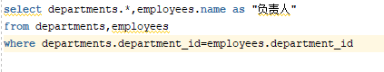
  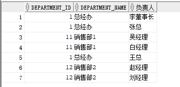
  
  7.查询部门表，显示部门以及统计每个部门的销售总金额。
  
  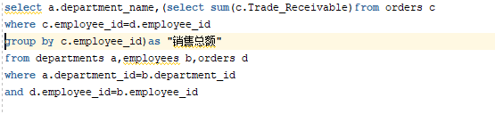
  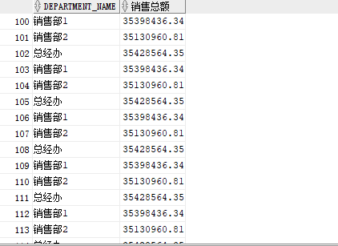
